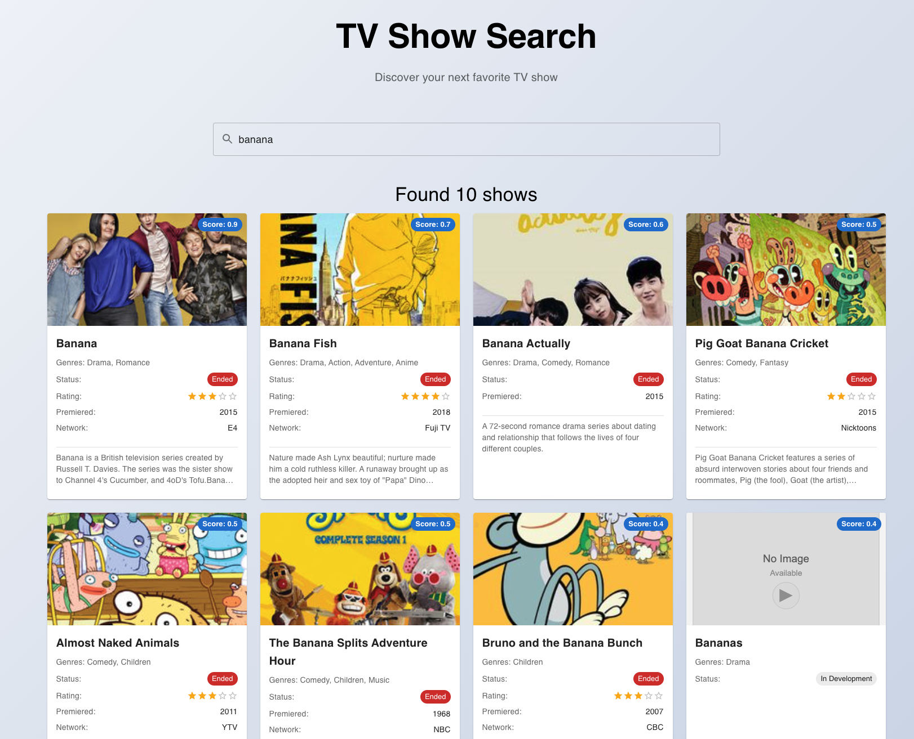

# tvmaze

A TV show search application built with React, TypeScript, and Node.js that allows users to search for TV shows using the TVMaze API. The application features a modern, responsive interface for discovering and exploring TV show information.



## Features

-   Search TV shows by title
-   View detailed show information
-   Responsive design
-   Real-time search results
-   Modern UI with Material-UI components

## Tech Stack

-   **Frontend**: React, TypeScript, Vite, Material-UI
-   **Backend**: Node.js, Express, TypeScript
-   **API**: TVMaze API integration

## Getting Started

1. Install backend dependencies:

    ```bash
    cd backend && npm install
    ```

2. Install frontend dependencies:

    ```bash
    cd frontend && npm install
    ```

3. Start the backend server:

    ```bash
    cd backend && npm run dev
    ```

4. Start the frontend development server:

    ```bash
    cd frontend && npm run dev
    ```

5. Open http://localhost:5173 in your browser

## Project Structure

-   `frontend/` - React application with TypeScript
-   `backend/` - Node.js API server
-   `shared/` - Shared TypeScript types
